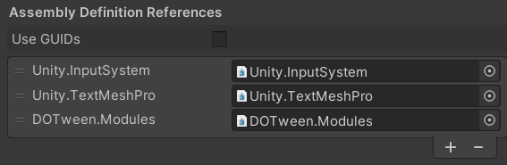

# UnityUtils
A mix of utils for Unity3D. Some are my own, others are copied and adapted.

I personally use this scripts for my game jam entries.

## How to install
1. Install [DOTween](https://assetstore.unity.com/packages/tools/animation/dotween-hotween-v2-27676)
2. Setup DOTween and generate ASMFDEF files
3. Open the package manager (Window → Package Manager)
4. Add Package from git URL https://github.com/jesusnoseq/UnityUtils or clone repo and add it from disk

### If there are some console errors
#### Make sure that assembly definition references are OK
1. Find and select the package unity utils in package folder from unity project panel
2. Open Runtime folder and select the Assembly Definition Asset file (com.jesusnoseq.util)
3. Go to Assembly Definition References and make sure they looks like this

4. Remove missing references and add the ones that are missing from the image

## List of Utilities by categories

### Camera
* FollowLocalPlayer → A rudimentary way to follow a player in a X side scroller game
* SmoothCamera2D → The smooth way to make the camera follow a transform target
* MirrorFlipCamera → Create the mirror effect on a camera

### Compatibility
* MouseClick → Handle mouse clicks indifferently of the input system. 
* MousePosition →  Handle mouse the position indifferently of the input system

> These two mouse scripts should be executed before reading the mouse clicks or position to work optimally. 
> Change the order in: Edit > Project Settings > Script Execution Order

### Coroutines
* CoroutineUtils → Handful set of coroutines functions to make them easy to use

### Data
* AdvancedStateMachineBehaviour → Unity StateMachine with some extra methods
* DataSerializer → serialize data to base64, bytes or string
* JsonHelper → serilize from and to JSON format
* Hasher → implement SHA256 hashing function
* PlayerPrefsX → handle save and load complex data types
* Shuffle → shuffle the items of a list
* ValidationUtils → implements some validation functions for emails and passwords

### Editor
* SelectionBase → helps to avoid selecting children objects

### Extensions
* AnimatorExtensions  → add GetBehaviour and IsPlaying methods
* CollectionUtils → add IndexOf and IndexOfOrZero for arrays
* EmumUtils → convert Enum to Dictionary and the other way around 
* GameObjectExtensions → add GetInterface/s methods
* IntegerExtensions → add ParseInt and ParseNullableInt methods
* RandUtils → add RandomEnumValue and RandomItemFromList methods
* RendererExtensions → add IsVisibleFrom method

### Game Flow
* LoadScene → script to load a scene by name
* OnSceneLoad → Triggers on scene load
* QuitApplication → Implement system-conditioned application quit

### GameObjectActions
* AutoRotate → automatically rotates a gameobject
* ChangePointer → change mouse cursor
* GoVector → causes the object to move in the specified vector 
* LightBlink → make a light object to blink
* LookAt → make a game object to look at other game object
* LookAtMouse → make a game object look at the mouse
* MoveToMouse → move object to follow the cursor
* SinMove → make a game object to move following a sin function

### Game Objects
* BasicPooler → implements a basic object pooler pattern
* DontDestroy → avoid the destruction of a game object with script beetwen scenes
* MouseClicks → jandle mouse clicks events
* PlayerSpawn → useful to spawn the players prefab in a location
* Singleton
    * MonoBehaviourSingleton → implement a simple singleton pattern
    * MonoBehaviourSingletonPersistent → singleton that is not destried between scenes

### Integrations
* InternetReadiness → check for internet connection
* RankClient → A custom Rank API integration
* HTTP
    * RequestManager

### Localization
Localization → manage transalations 

### Shaders
TO-DO

### Sound
* MusicManager → handle the background music (looped and persistent between scenes)
* SoundManager → play sound effects with a randomized variance

### UI Helpers
* Counter → A simple countdown counter
* FPS → Frame Per Seconds counter. Just add the prefab to your scene
* Menu → Manage Animated menus easily
* AlwaysOnTop → Set the game window always over the top
* BlinkText → Make text component blink
* FadeColor → Fade the color of a sprite component 

## TO DO
* Add camera examples
* Add coroutines examples
* Add editor examples
* Add extensions examples
* Add unity extensions examples
* Add Localization examples
* Improve and add integration examples
* Update deprecated methods and add http examples
* Prepare shaders and examples
* Improve Localization and add examples
* Add tests

## Dependencies
* DOTween
* TextMesh Pro

## Ohter Github repos with useful unity resources
* [awesome-unity](https://github.com/RyanNielson/awesome-unity)
* [twitch-chat-connect](https://github.com/rhomita/twitch-chat-connect)
* [Anime-Speed-Lines](https://github.com/MirzaBeig/Anime-Speed-Lines)

## Authorship
I try to keep the original authorship of the scripts with links to the source as code comments. These links usually lead to answers.unity.com. 

If any authorship is not well identified or you don't want your script to be here, let me know.

## Collaborate!
PRs are welcome. 

Please feel free to suggest new scripts or improve the current ones.
